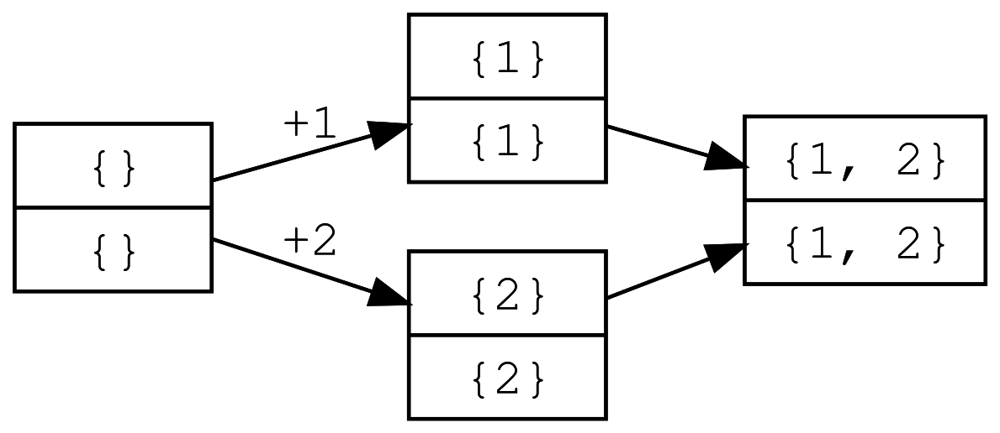

# CRDTs
Conflict-free (or Convergent, or Commutative, or Confluent) Replicated Data
Structures (CRDTs) are distributed data structures based on monotonic join
semilattices and commutative updates that are guaranteed to provide strong
eventual consistency. There are a [lot of papers][crdt-papers] formalizing and
explaining CRDTs. This repository contains code to visualize them.

## Table of Contents
- Counters
    - [State Based G-Counter](#state-based-g-counter)
    - [State Based PN-Counter](#state-based-pn-counter)
- Registers
    - TODO
- Sets
    - [State Based G-Set](#state-based-g-set)
    - [State Based 2P-Set](#state-based-2p-set)

## State Based G-Counter


## State Based PN-Counter


## State Based G-Set



## State Based 2P-Set


## Building and Running
```bash
opam install core ocamlgraph
./build.sh
./main.byte
```

[crdt-papers]: https://christophermeiklejohn.com/crdt/2014/07/22/readings-in-crdts.html
